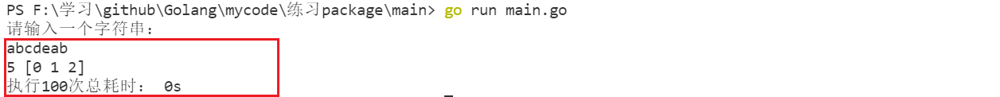

# 最长无重复子串

⽤Go实现⼀个算法：给定⼀个字符串，找出其中最长的包含非重复字符的子字符串，输出其长度和下
标。有多个时全部下标都输出。

输⼊：abcdeab
输出：5,[0,1,2] //子串分别为abcde，bcdea, cdeab

功能要求

1. 从命令⾏输⼊⼀个字符串
2. 结果打印到控制台
3. 内部重复执⾏100次，最后打印出总耗时    

**我的思路：**

- 枚举左边界，确定每一个左边界对应的最大子串的长度，保留最大的

```go
package main

import (
	"fmt"
	"time"
)

func main() {
	var str string
	var l int
	var arr []int

	fmt.Println("请输入一个字符串：")
	fmt.Scan(&str)

	start := time.Now()
	for i := 0; i < 100; i++ {
		l, arr = maxSubString(str)
	}
	elasped := time.Since(start)

	fmt.Println(l, arr)
	fmt.Println("执行100次总耗时：", elasped)
}

func maxSubString(str string) (int, []int) {
	//枚举左边界，确定每一个左边界对应的最大子串的长度，保留最大的
	len := len(str)
	r := 0 //右边界
	max, arr := 0, []int{}

	mp := map[byte]int{}

	//枚举左边界
	for i := 0; i < len && r < len; i++ {
		//确定右边界
		for j := r; j < len; j++ {
			if mp[str[j]] == 0 {
				mp[str[j]]++
				r++
			} else {
				break
			}
		}
		if r-i == max {
			arr = append(arr, i)
		} else if r-i > max {
			max = r - i
			arr = []int{i}
		}
		delete(mp, str[i])
	}
	return max, arr
}
```

运行结果如下：

